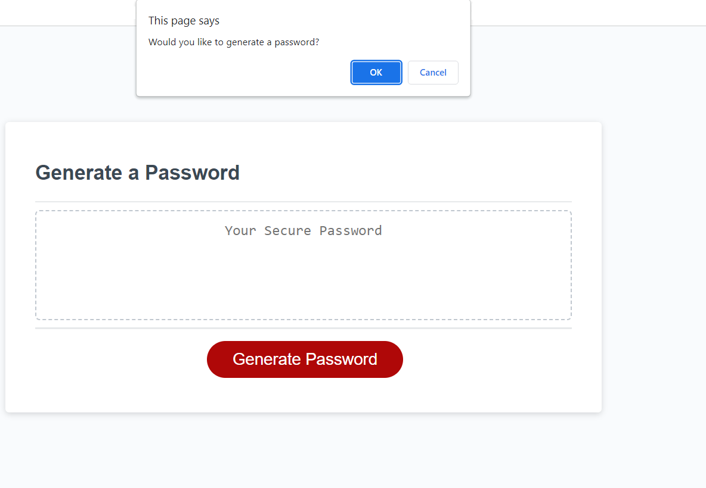
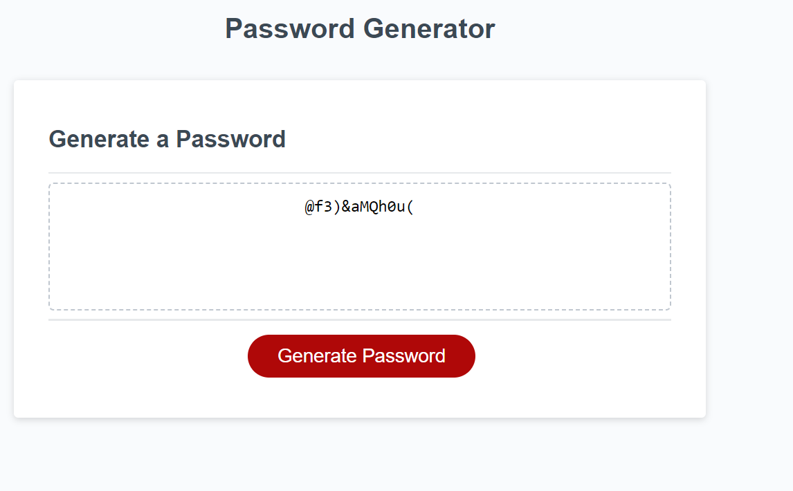

# Password Generator

## Description

I built this website to help anyone generate a password between 8-128 characters, with any type of characters they wish (uppercase, lowercase, numeric, and special characters).

This project helped me learn a lot about functionsa and arrays in JS!

Here's a link to try it out: https://zeinahares.github.io/Password-Generator/

## Installation

N/A

## Usage

Click on the Generate button to begin selecting your criteria through prompts on your web browser.

Then, you can input how long you want your password to be between 8-128 characters. It also asks whether you want lowercase, uppercase, numeric or special characters through a series of confirm prompts. If the length is not between 8-128 or no character type was chosen, you get an error message telling you to try again.

  

## License

MIT License

Copyright (c) 2023 zeinahares

Permission is hereby granted, free of charge, to any person obtaining a copy
of this software and associated documentation files (the "Software"), to deal
in the Software without restriction, including without limitation the rights
to use, copy, modify, merge, publish, distribute, sublicense, and/or sell
copies of the Software, and to permit persons to whom the Software is
furnished to do so, subject to the following conditions:

The above copyright notice and this permission notice shall be included in all
copies or substantial portions of the Software.

THE SOFTWARE IS PROVIDED "AS IS", WITHOUT WARRANTY OF ANY KIND, EXPRESS OR
IMPLIED, INCLUDING BUT NOT LIMITED TO THE WARRANTIES OF MERCHANTABILITY,
FITNESS FOR A PARTICULAR PURPOSE AND NONINFRINGEMENT. IN NO EVENT SHALL THE
AUTHORS OR COPYRIGHT HOLDERS BE LIABLE FOR ANY CLAIM, DAMAGES OR OTHER
LIABILITY, WHETHER IN AN ACTION OF CONTRACT, TORT OR OTHERWISE, ARISING FROM,
OUT OF OR IN CONNECTION WITH THE SOFTWARE OR THE USE OR OTHER DEALINGS IN THE
SOFTWARE.
